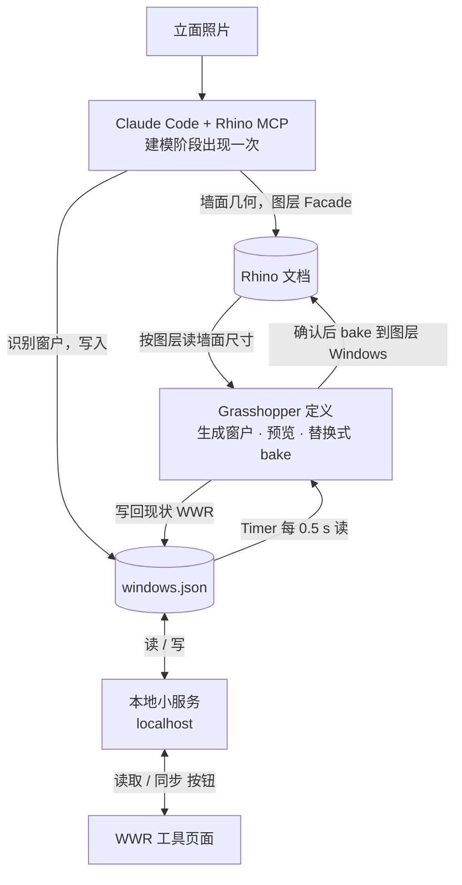

# Prototype 计划：照片 → Rhino MCP → Grasshopper ↔ WWR 工具 同步链路

Sep 26, 2026 · @Ayden

## 0. 定位

Prototype 只证明一件事：三条数据链路能打通——照片变成几何、WWR 工具的值能改 Rhino 里的窗、Rhino 里的窗面积能回到工具。它不证明设计价值，也不追求精度。

成品的目标另在其后：让 building code、performance calculation 里的抽象数字重新连接到真实立面几何，建筑师能直接看到 regulation、performance 和 design geometry 之间的关系。

**已确认的决定（2026-09-26）**

| 事项 | 决定 |
| --- | --- |
| 数据中枢 | `windows.json` 参数表；窗户几何由 Grasshopper 生成，不由 MCP 直接建 |
| MCP 建什么 | 墙面（背景几何）+ 识别窗户写入参数表 |
| 跨界的量 | 只有 WWR（百分比）。工具的热工计算仍用自己的抽象体块，不受真实尺寸影响，`digest()` 不变 |
| 立面尺寸来源 | 从 MCP 重建的墙面读取 |
| 分配规则 | 该立面全部窗户等比缩放宽度；高度、窗台高不变 |
| 朝向绑定 | 在 WWR 工具里手动指定一次（南/东/北/西），存入 `windows.json` |
| 通道 | 工具页面「读取 / 同步」按钮 ↔ 本地小服务 ↔ `windows.json` ↔ GH Timer 轮询 |
| 反向通道 | 进 prototype：GH 算出现状 WWR 回传工具 |
| 实时性 | 点「同步」后 1–2 秒 Rhino 更新即可 |
| bake | 调整期间只预览；点「确认」后按 Window ID 替换式 bake |
| 环境 | Rhino 8、Grasshopper 1、Windows、McNeel 官方 Rhino MCP（RhinoAI） |
| 插件 | 不装；GH 自带 Python 3 脚本组件 + Timer |
| Claude Code | 只在建模和搭 GH 定义阶段出现，同步不经过它 |
| BCBC 工具 | 不出场 |
| 照片 | 网上找一张正对镜头的单侧立面 |

**明确不做**：BCBC、多立面、透视校正、识别精度校验、现状/上限/建议三态叠加、撤销。

## 1. 系统组成与数据流

五个部件，一个文件把它们连起来。`windows.json` 是唯一的 source of truth，任何一方要改窗户都写它，任何一方要知道窗户都读它。



**各部件的角色**

| 部件 | 角色 | 读 | 写 |
| --- | --- | --- | --- |
| Claude Code + Rhino MCP | 一次性入口：看照片、建墙面、识别窗户、搭 GH 定义 | 照片 | Rhino 墙面、`windows.json` 初稿、GH 定义 |
| `windows.json` | 中枢，唯一真值 | — | — |
| Grasshopper 定义 | 参数化引擎：参数 → 窗户几何；几何 → 现状 WWR | `windows.json`、Rhino 墙面 | 预览、bake、`windows.json` 的 `existing_wwr` |
| 本地小服务 | 页面和文件之间的搬运工，同时以 `http://localhost` 提供工具页面 | `windows.json` | `windows.json` 的 `target_wwr` |
| WWR 工具页面 | 约束来源：给出该立面的 WWR | `existing_wwr`（读取按钮） | `target_wwr`（同步按钮） |

**两条通道**

- 正向（工具 → Rhino）：点「同步」→ 页面 POST 当前立面 WWR → 服务写入 `target_wwr` → GH Timer 读到变化 → 按 §3 换算窗宽 → 预览更新。
- 反向（Rhino → 工具）：GH 每次求解后把现状 WWR 写入 `existing_wwr` → 页面点「读取」（或打开时）GET → 把对应朝向的滑块设为该值。

为什么不让 GH 自己开 HTTP 服务、页面直接连它：GH 脚本组件里跑后台线程在求解时容易被打断，而一个文件谁都能读写、出错时能直接打开看。多一个进程换来可调试性，prototype 阶段值得。

## 2. windows.json 的约定

单位一律米，坐标以立面左下角为原点、x 沿墙面向右、y 向上。示例文件是给后面每一步对照用的，字段名一旦定下就不再改。

```json
{
  "version": 1,
  "orientation": "S",
  "facade": { "layer": "Facade", "width": 12.4, "height": 9.6, "area": 119.0 },
  "existing_wwr": 0.21,
  "target_wwr": null,
  "scale_mode": "width",
  "min_width": 0.3,
  "windows": [
    { "id": "W01", "base_x": 1.2, "x": 1.2, "sill": 0.9, "base_width": 1.5, "width": 1.5, "height": 1.8 },
    { "id": "W02", "base_x": 4.0, "x": 4.0, "sill": 0.9, "base_width": 1.5, "width": 1.5, "height": 1.8 }
  ],
  "updated_by": "gh",
  "updated_at": "2026-09-26T14:02:11"
}
```

| 字段 | 谁写 | 说明 |
| --- | --- | --- |
| `orientation` | 工具页面 | 南/东/北/西之一，手动指定一次；工具只把这个朝向的滑块和文件绑定 |
| `facade.layer` | MCP | 墙面所在图层名，GH 靠它找墙 |
| `facade.width / height / area` | GH | 从图层 `Facade` 上的面读出，不手填 |
| `existing_wwr` | GH | Σ(窗宽 × 窗高) ÷ `facade.area`，每次求解后写 |
| `target_wwr` | 工具页面 | 「同步」按钮写；`null` 表示尚未同步，GH 按 `windows[]` 原样显示 |
| `scale_mode` | 固定 | prototype 只有 `width`，预留给成品 |
| `windows[].base_x / sill` | MCP，GH 只读 | 窗左下角在立面上的原始位置，永不改写；缩放时以它为基准、按窗中心不动重算 |
| `windows[].x` | MCP 写初值；GH 改写 | 窗左下角当前位置，GH 每次换算后写回（与 `width` 同样处理） |
| `windows[].width / height` | MCP 写初值；GH 改写 width | width 是当前值，GH 每次换算后写回，使文件始终等于 Rhino 里的状态 |
| `windows[].base_width` | MCP，GH 只读 | 照片识别的原始宽度，永不改写；缩放系数 k 和现状对比都以它为基准，连续同步不累积误差 |
| `min_width` | 固定 | 窗宽下限（m），prototype 为 0.3；改数值不用动 GH 定义 |
| `updated_by / updated_at` | 谁写谁填 | GH 用它判断文件是否变过，避免每 0.5 s 重算一次 |

图层约定：`Facade`（MCP 建的墙面，GH 只读）、`Windows`（GH bake 的窗，按 `id` 写入对象名，再次 bake 先删同名对象）。

## 3. 换算规则

正向：目标窗面积 = `target_wwr` × 墙面面积，所有窗的宽度以 `base_width` 为基准乘同一个系数 k，高度和窗台高不动。k 总是从原始值算，不从上一次的 `width` 算，所以来回同步多少次都不会漂。

```latex
k = \frac{\text{target\_wwr} \cdot A_{facade}}{\sum_i b_i h_i}, \qquad w_i = k \, b_i, \qquad x_i = x_i^{base} + \frac{b_i - w_i}{2}
```

反向：现状 WWR 直接由几何算出，写入 `existing_wwr`。

```latex
\text{existing\_wwr} = \frac{\sum_i w_i h_i}{A_{facade}}
```

两条边界：

- 窗宽上限：相邻窗不能重叠、不能超出墙面。k 超过几何允许值时 GH 取允许的最大 k，并把实际达到的 WWR 写回 `existing_wwr`，页面读取后滑块会停在能达到的位置——这就是「法规/性能值碰到真实几何」的第一次可视化。
- 窗宽下限：`min_width`（prototype 为 0.3 m），低于它不再缩，理由同上。

换算只发生在 GH 里；工具页面和服务不做任何几何计算。

## 4. 各部件的工作内容

四块工作，其中两块由 Claude Code 通过 Rhino MCP 完成，两块是普通代码。

**4.1 Rhino MCP 重建（Claude Code 会话，一次）**

- 输入：照片 + 人工给的比例尺（如「楼层高 3.2 m」或「门高 2.1 m」）。
- 产出：图层 `Facade` 上一个矩形平面（宽 × 高按比例尺换算）；`windows.json` 初稿（每扇窗的 `id / base_x / x / sill / base_width / width / height`，按照片估计；初稿里 `x = base_x`、`width = base_width`）。
- 不做：透视校正、窗框细节、多面墙。窗的位置允许有明显误差，链路验证不依赖它。

**4.2 Grasshopper 定义（Claude Code 通过 MCP 搭建，之后手动微调）**

组件不超过十个，核心是三个 Python 3 脚本组件：

| 组件 | 做什么 |
| --- | --- |
| Timer（0.5 s）→ 读文件 | 读 `windows.json`，比较 `updated_at`，没变就不往下传 |
| 换算 + 生成 | 从 `Facade` 图层读墙面尺寸；按 §3 算 k；生成每扇窗的矩形面；写回 `existing_wwr`、`windows[].width / x`、`facade.*` |
| bake | 一个 Boolean Toggle 触发：删 `Windows` 图层上同名对象，再按 `id` 命名放入新面 |

预览用 GH 自带的显示；bake 只在切换 toggle 时执行一次，不随 Timer 重复。

**4.3 本地小服务（Python 单文件，约 50 行）**

- `GET /` 提供 WWR 工具页面（静态文件），页面因此运行在 `http://localhost:8765`，不存在 `file://` 跨域问题。
- `GET /state` 返回 `windows.json` 原文。
- `POST /state` 接收 `{ "target_wwr": 0.18 }`，只改这一个字段和 `updated_by / updated_at`，其余保留。
- 启动方式：双击一个 `.bat`。

**4.4 WWR 工具改动（V06 的 `wwr-tool.html`，改动尽量小）**

- 「各立面」面板内新增一行：`绑定到 Rhino：[未绑定 ▾]`，选项南/东/北/西 + 未绑定。只在选中的朝向面板出现「读取」「同步」两个按钮。
- 「读取」：GET `/state`，把该朝向的 WWR 滑块设为 `existing_wwr`，触发 `render()`。
- 「同步」：POST 该朝向滑块的当前值。
- 页面顶部一行状态文字：`Rhino：已连接 / 未连接（服务未启动）`，GET 失败即为未连接，按钮置灰。
- 不改 `calc()`、不改 `digest()`、不改 `uiDigest()`；自检新增 3 项（绑定下拉、按钮出现/隐藏、未连接时置灰）。

## 5. 实施顺序

每一步都能单独验证，前一步不通不进下一步。1–3 步不碰照片，先用手写的 `windows.json` 把链路跑通。

| 步 | 做什么 | 完成标准 |
| --- | --- | --- |
| 1 | 手写 `windows.json`（一面墙、两扇窗）；Rhino 里手画 `Facade` 矩形；搭 GH 定义 | 改文件里的 `target_wwr` 存盘，1 s 内 Rhino 预览里窗变宽；`existing_wwr` 被写回 |
| 2 | bake | 切 toggle → `Windows` 图层出现两个按 id 命名的面；再切一次不产生重复对象 |
| 3 | 本地服务 + 工具页面改动 | 在页面点「同步」→ Rhino 更新；点「读取」→ 滑块跳到几何现状 |
| 4 | 边界 | 把滑块拉到 60% → Rhino 里窗停在几何上限，「读取」后滑块回落到实际值 |
| 5 | 照片 | Claude Code + MCP 从照片建 `Facade` 和 `windows.json`，替换第 1 步的手写文件；链路照常工作 |
| 6 | 演示脚本 | 按 §6 完整走一遍并录屏 |

第 5 步放最后是刻意的：照片识别是最不确定的一步，把它放在链路已经证明可用之后，失败时不会拖累其余部分。

## 6. 验收方法与演示脚本

验收全部是可观察的动作和数字，不评价建模好不好看。

| 验收项 | 方法 | 通过标准 |
| --- | --- | --- |
| 正向延迟 | 页面点「同步」，秒表计时到 Rhino 视口变化 | ≤ 2 s |
| 反向一致 | 「读取」后滑块值 vs GH 面板里的 `existing_wwr` | 相差 < 0.5 个百分点（滑块步进所致） |
| 换算正确 | 用文件里的数手算 k 和窗宽，与 Rhino 里量的窗宽比 | 差 < 1 mm |
| bake 不重复 | 连续 bake 三次，数 `Windows` 图层对象 | 等于窗数 |
| 几何边界 | 滑块拉到 60% | 窗不重叠、不出墙；读取后滑块回落 |
| 工具不受影响 | V06 自检 100 项 + 新增 3 项；`digest()` 与 V06 逐字符一致 | 全部通过 |
| 未连接 | 关掉服务后打开页面 | 状态显示未连接，按钮置灰，其余功能照常 |
| 照片链路 | 第 5 步产出的文件替换手写文件 | 以上各项仍通过 |

**演示脚本（约 3 分钟）**

1. 打开 Rhino：一面墙、照片里的窗户已在 `Windows` 图层。旁边是照片。
2. 打开工具页面，状态显示已连接；选中绑定的朝向，点「读取」——滑块跳到这面墙的现状 WWR。
3. 在工具里看这个立面的采光 / 得热 / 过热指标，按建议把 WWR 拉低。点「同步」——Rhino 里所有窗同时变窄。
4. 把滑块拉到明显超出的值，点「同步」——窗停在几何允许的最大值；点「读取」——滑块回落，说明几何在约束数字。
5. 切 bake toggle——窗写入 Rhino 文档，可以关掉 GH 继续用。

第 4 步是整个演示的重点：它是「抽象数字碰到真实几何」最小的一个例子。

## 7. 风险与备用方案

| 风险 | 可能性 | 备用方案 |
| --- | --- | --- |
| Rhino MCP 从照片估的窗位置偏差大 | 高 | 可接受；演示时说明。必要时人工在 `windows.json` 里改几个数 |
| MCP 搭出的 GH 定义有错，需要多次迭代 | 中 | 定义很小，最坏情况手动连线 15 分钟 |
| GH Timer 轮询导致 Rhino 卡顿 | 低 | 间隔改 1 s；用 `updated_at` 判断没变就不重算 |
| 浏览器阻止 `localhost` 请求 | 低 | 页面由同一服务提供，同源；若仍失败改为按钮下载 `windows.json` + GH 监视下载文件夹 |
| bake 删同名对象误删用户自己画的东西 | 低 | 只删 `Windows` 图层上且对象名匹配 `W\d+` 的对象 |
| 演示现场服务起不来 | 低 | 备用：「同步」改为复制 JSON 到剪贴板，粘贴进 GH 面板 |

## 8. 待决定项与留到成品的事项

**开工前已定（2026-09-26）**

1. 端口 `localhost:8765`；`windows.json` 放在 `Version_07/rhino/`。
2. 工具改动放在 V07：复制 V06 为 V07，先提交，再改。
3. 「读取」在页面打开时自动执行一次；服务未启动时显示未连接、按钮置灰，其余功能照常。
4. 窗宽下限 0.3 m，作为 `windows.json` 里的 `min_width` 字段，不写死在 GH 里；改数值不用动定义。
5. 窗的位置与宽度同样处理：`base_x` 存原始值、GH 只读；`x` 存当前值、GH 每次换算后写回。文件因此始终等于 Rhino 里的状态，且换算不累积误差。

**留到成品**

- BCBC 工具接入：同一个文件加 `max_wwr` 字段，GH 多画一层半透明的最大允许窗框。
- 四个立面：`windows.json` 改为按朝向分组，GH 定义按朝向复制。
- 分配规则可选（等比宽 / 改高 / 手选一扇）：`scale_mode` 字段已预留。
- 三态叠加显示、差异标注、面积数字标在几何上。
- 透视校正与识别精度校验。
- 真实立面尺寸回灌工具的热工计算（目前工具用抽象体块，是否回灌需另议）。

---

## 实施记录（2026-09-26，第 1–3 步；每步做完停下等用户确认）

**环境。** 电脑原本没有系统 Python，经用户确认后用 winget 装了 Python 3.12.10（仅当前用户）。Rhino 8 由 MCP 自动启动；Grasshopper 定义由 Claude Code 通过 MCP 搭建。

**第 1 步（链路）。** `rhino/windows.json` 手写一面墙两扇窗；Rhino 新文档（米制）图层 `Facade` 上一块 12.4 × 9.6 m 的墙面（朝 −Y）。Grasshopper 定义 `rhino/wwr_sync.gh` 共 6 个组件：Trigger 0.5 s → 路径面板 → 「WWR sync」Python 3 脚本（读文件、按 §3 换算、生成窗面预览、写回 `existing_wwr` / `width` / `x` / `facade.*`）→ 状态面板；Boolean Toggle → 「WWR bake」脚本。计划里的「读文件」和「换算 + 生成」合成一个脚本：没变化时靠 `updated_at` 跳过重算，拆开反而多传一次。写回后记住自己写的时间戳，不会因自己的写入再触发重算。窗面比墙面往外 2 cm，避免与墙面重叠闪烁。
验收：改文件目标 7% → 往返 363 ms，写回 0.07，窗宽 2.3147 m 与手算一致；目标 10% 时两扇窗在 k = 1.867 相碰，停在 2.8 m、写回 8.47%（§3 的几何上限已生效）。MCP 截图只拍文档对象、不拍 GH 预览，预览几何用输出口的包围盒确认。

**第 2 步（bake）。** 切开关三次，`Windows` 图层每次 2 个对象（W01、W02，宽 2.3147 m），无重复；只在开关由关到开时执行一次。修了一处：GH 传给 bake 的是内部几何编号，需先取回几何再放进 Rhino。文档总数 7 是撤销记录里的旧窗，实际 3 个对象。

**第 3 步（服务 + 页面）。** `rhino/server.py`（标准库，约 100 行）：`/` 提供页面、`GET /state` 原文、`POST /state` 只接受 `target_wwr` 与 `orientation`；`start_server.bat` 双击启动并自动开浏览器。页面改动：头部一行「Rhino：已连接 / 未连接（服务未启动）」；「各立面」顶部一行「绑定到 Rhino」下拉（未绑定 + 四个立面，文字随朝向）；绑定立面的面板内出现「读取」「同步」按钮和一行小字；打开页面自动读取一次（自检模式除外），文件里的 `orientation` 作为上次绑定恢复；`calc()` / `digest()` / `uiDigest()` 未动。自检新增 6 项，共 106 项。
验收：页面点「同步」6% → 文件 `target_wwr` 0.06 → GH 写回 0.06、窗宽 1.984 m；滑块乱拖到 20% 后点「读取」→ 回到 6%；`digest()` 26 202 字符、SHA-256 前 16 位 d4e82395b2e0eb5e，与 V06 相同；汇总行 / 指标表 / 详情面板哈希与 V06 相同；未连接（经无 `/state` 的静态服务打开）时状态显示未连接、按钮置灰、其余功能照常。

**待做。** 第 4 步（边界：滑块 60%）、第 5 步（照片）、第 6 步（演示脚本）。
