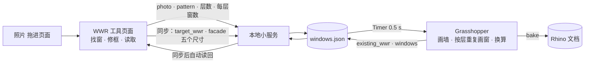

# Version_08 计划：页面读照片、工具定尺寸、Rhino 只显示（待确认，第 2 稿）

日期：2026-09-26。状态：计划，未开始修改代码。确认后：复制 V07 为 V08 → 提交 → 再修改。范围：仍只做一个立面（南）；`calc()` / `digest()` / `uiDigest()` 不改，代码默认值不改。

第 1 稿的方向（工具驱动 Rhino 墙面尺寸、照片只贡献节奏、按层重复）保留；第 2 稿按用户意见把「照片→比例」这一步从 Claude Code 对话搬进页面，并重新定义「读取」「同步」两个按钮。

---

## 0. 定位与已定的决定

**用户已定（2026-09-26）**

| 事项 | 决定 |
|---|---|
| 尺寸来源 | 工具是主：立面长度、层高、层数、窗台、窗顶由页面写入参数表；Grasshopper 按参数画墙和窗（长度、层高 parametric） |
| 高度对应 | 按层重复：照片节奏只管水平方向；窗高用工具的窗台 / 窗顶；每层重复一遍 |
| 层数 | 现阶段按 1 层；照片若是多层，数出的层数和每层窗数填进工具的「层数」「每层窗数」 |
| 照片入口 | 页面上一个可拖放图片的方框；放入后点「读取」 |
| 「读取」的含义 | 读取**照片里**原生的窗户数量、层数和大小比例，写进工具（层数、每层窗数、窗墙比） |
| 立面数 | 仍只做南立面一面 |

**「读取」和「同步」在 V08 的分工**

- 读取 = 照片 → 工具。产出：层数、每层窗数、窗墙比（照片比例套在工具的墙上算出），以及写进参数表的 `pattern`。
- 同步 = 工具 → Rhino。发出目标窗墙比和五个尺寸，然后页面自己等 Grasshopper 写回，把实际达到的窗墙比填回滑块（V07 需要再点一次「读取」，V08 自动）。
- Rhino 不再是任何数字的来源，只负责显示和 bake。

**代价（演示时要讲明）。** 页面上的数字描述的是「用了这张照片节奏的工具体块」，不是照片里那栋房子。

---

## 1. 数据流



Claude Code + Rhino MCP 只在搭 Grasshopper 定义时出现一次；日常使用不需要它，也不需要联网。

---

## 2. 页面上的照片面板

放在主栏「平面」旁边，新增一张 sheet「立面照片」（手机宽度下堆叠在平面之下）。

**2.1 放入照片。** 一个虚线方框 `#photoDrop`：拖放图片，或点击 / 键盘 Enter 打开文件选择（`<input type="file" accept="image/*">`，包在 `<label>` 里）。放入后方框变成画布 `<canvas>`，照片按宽度缩放显示（最长边不超过 1600 px 参与计算，显示按容器宽）。照片同时以 data URL 发给服务存为 `rhino/facade_photo.<ext>`（≤ 10 MB）。

**2.2 找窗（自动 + 手动修正，决定项 1）。**
- 自动：灰度 → Otsu 阈值 → 比周围暗的连通区域 → 过滤（面积 ≥ 画面 0.1%、高宽比 0.3–8、填充率 ≥ 0.6）→ 得到候选矩形，画成蓝框。只在「立面框」内找（见下）。
- 立面框：第一次放入照片后自动取整幅画面；你可以拖出一个矩形重新框定立面范围（橙框，只有一个）。
- 手动修正：在画布上拖拽画新窗框；点一个框选中，Delete / Backspace 删除；方向键微移 1 px，Shift + 方向键 10 px。框列表也以文字列在画布下方（每行「W03 左 39.5% 宽 11.6%」，带删除按钮），保证不靠鼠标也能操作。
- 不做透视校正：框是画面坐标系里的正矩形，照片应尽量正对立面。

**2.3 读取。** 按当前的立面框和窗框计算（纯函数 `patternFromBoxes(facadeBox, windowBoxes)`，可自检）：
- 层数：按窗框的竖向中心聚类，两组中心相距超过半个窗高就算不同层；层数 = 组数。
- 每层窗数：取窗最多的那一层的个数；`pattern` 也取这一层（决定项 3）。
- 比例：每扇窗 `u` = 左边缘到立面框左边的距离 ÷ 立面框宽，`w` = 框宽 ÷ 立面框宽，按 `u` 排序编号 W01…。
- 写入工具：`S.floors` = 层数、`S.f[k].n` = 每层窗数、`S.f[k].wwr` = Σw · (head − sill) / H（照片节奏套在工具的墙上），同步三个滑块，`render()`。
- 写入参数表：`POST /state` 带 `photo`（文件名、层数、每层窗数、画面尺寸、立面框、日期）和 `pattern`。Grasshopper 随即按新节奏重画。
- 页面刷新后从参数表恢复框（`photo.boxes`），照片从服务读回显示。

**2.4 同步（改为自动读回）。** `POST /state` 带 `target_wwr` 与 `facade` 五个尺寸，然后每 300 ms `GET /state` 最多 3 s，等到 `updated_by === 'gh'` 且时间戳晚于发出时刻，把 `existing_wwr` 填回滑块并提示「Rhino 实际达到 x%」；超时则提示「Rhino 没有回应」。

**2.5 尺寸的即时写入（决定项 2）。** 绑定且已连接时，体块长度 / 宽度、层数、层高、窗台、窗顶六个滑块拖动即 300 ms 去抖 `POST /state {facade}`，Rhino 墙跟着变，窗按比例重排、窗墙比不变。

**2.6 保留的旧行为。** 打开页面时静默 `GET /state` 一次：恢复绑定朝向、照片与框、并把 `existing_wwr` 填进滑块（自检模式除外）。V07 的「读取」按钮（从 Rhino 读现状）不再单独存在，它的作用并入 2.4 的自动读回和这里的打开时恢复。

---

## 3. windows.json 第 2 版

```json
{
  "version": 2,
  "orientation": "S",
  "facade": { "width": 20.0, "floor_height": 3.0, "floors": 1, "sill": 0.6, "head": 2.4, "layer": "Facade" },
  "photo": { "file": "facade_photo.webp", "image_w": 1200, "image_h": 675,
             "facade_box": [235, 195, 700, 520], "floors": 1, "windows_per_floor": 5,
             "boxes": [[268,285,318,490], [340,278,390,488], [410,270,462,486], [485,262,543,484], [578,250,638,482]],
             "method": "page auto-detect + manual", "date": "2026-09-26" },
  "pattern": [
    { "id": "W01", "u": 0.070, "w": 0.116 }, { "id": "W02", "u": 0.233, "w": 0.116 },
    { "id": "W03", "u": 0.395, "w": 0.116 }, { "id": "W04", "u": 0.558, "w": 0.121 }, { "id": "W05", "u": 0.749, "w": 0.121 }
  ],
  "min_width": 0.3,
  "target_wwr": null,
  "existing_wwr": 0.3512,
  "windows": [ { "id": "W01-1", "floor": 1, "x": 1.40, "width": 2.32, "sill": 0.6, "height": 1.8 } ],
  "updated_by": "gh",
  "updated_at": "2026-09-26T16:00:00.000"
}
```

| 字段 | 谁写 | 说明 |
|---|---|---|
| `facade.width` | 页面 | 绑定立面的长度：南 / 北 = 体块长 L，东 / 西 = 体块宽 W |
| `facade.floor_height / floors / sill / head` | 页面 | 来自滑块；窗台 / 窗顶用 `calc()` 同样的钳制（窗顶 ≤ 层高 − 0.3，窗台 ≤ 窗顶 − 0.4） |
| `facade.layer` | 固定 | bake 时墙面放的图层 |
| `photo.*` | 页面「读取」 | 框用画面像素坐标记录，页面刷新后据此恢复；GH 只读 `floors` 以外都不用 |
| `pattern[].u / w` | 页面「读取」 | 占 `facade.width` 的比例；GH 只读（相当于 V07 的 `base_x / base_width`） |
| `min_width` | 固定 | 窗宽下限 m |
| `target_wwr` | 页面「同步」 | 空 = 按 `pattern` 原样（k = 1） |
| `existing_wwr` / `windows[]` | GH | 展开后的每扇窗（米），使文件等于 Rhino 里的状态；页面只读 `existing_wwr` |

V07 的文件保留为 `windows_v07.json` 供对照。

---

## 4. 换算规则（Grasshopper）

记立面宽 L、层高 H、层数 F、窗高 h = head − sill、比例宽度之和 Σw。

```latex
k = \frac{t \cdot H}{\Sigma w_i \cdot h}, \qquad \text{width}_i = k \, w_i L, \qquad x_i = (u_i + \tfrac{w_i - k w_i}{2}) L, \qquad z_f = (f-1)H + \text{sill}
```

k 与 L、F 无关：拖长度或层数，窗按比例跟着变，窗墙比不变。反向 `existing_wwr = k · Σw_i · h / H`。

边界（V07 逻辑换到比例空间）：上限 k ≤ min(2u_i/w_i, 2(1−u_i−w_i)/w_i, 2|c_i − c_j|/(w_i + w_j))；下限 k ≥ max(min_width / (w_i · L))。L 变小时下限升高，是真实几何的约束。工具另有「总窗宽 ≤ 立面长度 90%」的上限（`calc()` 的 `maxW`），两边各管各的，读回后滑块停在 GH 能达到的值。

---

## 5. 各部件改动

**5.1 Grasshopper（`wwr_sync.gh`）。** 「WWR sync」不再从 Rhino 读墙：从文件读 `facade` 与 `pattern`，生成墙面（L × F·H，XZ 平面，朝 −Y）和按层重复的窗；按 §4 换算；写回 `existing_wwr`、`windows[]`。输出口加 `wall`。「WWR bake」替换式写入 `Facade` 图层名为 `Facade` 的面和 `Windows` 图层名匹配 `W\d+-\d+` 的面。组件数不变。

**5.2 本地小服务（`server.py`）。** `POST /state` 允许字段扩为 `target_wwr`、`orientation`、`facade`（五个数，范围检查）、`photo`（对象）、`pattern`（数组，每项 `id/u/w`，0 ≤ u、w ≤ 1）。新增 `POST /photo`：`{name, dataUrl}` → 存为 `rhino/facade_photo.<ext>`（只接受 png / jpg / webp，≤ 10 MB，文件名固定不用用户给的名字）；`GET /photo` 返回当前照片。

**5.3 页面（`wwr-tool.html`）。** 见 §2。新增纯函数：`rhinoFacadePayload(k)`、`patternFromBoxes(fb, boxes)`、`detectWindows(imageData, fb)`；它们不碰网络，自检可直接调用。绑定面板小字改为「Rhino 墙面 20.0 × 3.0 m（1 层，每层 5 扇，来自照片）」。

**5.4 Rhino 文档。** MCP 建的 4.3 × 2.85 m 墙删除；第一次 bake 后是 GH 写的 20 × 3 m 墙和 5 扇窗。

**5.5 照片步骤。** 不再是 Claude Code 的工作。第一次用现有照片走一遍 2.1–2.3，自动找窗的结果与 V07 的目测比对（位置差 < 立面宽 2%）。

---

## 6. 实施顺序

| 步 | 做什么 | 完成标准 |
|---|---|---|
| 1 | 复制 V07 为 V08，提交 | — |
| 2 | 参数表第 2 版（先用 V07 米数换算的比例手写）；GH 改为自己画墙、按层重复、新 k 公式 | 手改 `facade.width` 20 → 16：1 s 内 Rhino 墙变短、窗按比例重排、`existing_wwr` 不变；`floors` 1 → 2 出现第二排窗 |
| 3 | bake 含墙 | 切开关 → `Facade` 1 个面 + `Windows` 5 个面；再切不重复 |
| 4 | 服务：新字段 + `/photo` | curl 能存取照片、写入 pattern |
| 5 | 页面：照片面板（拖放、自动找窗、修框、读取）；同步自动读回；尺寸即时写入 | 拖入现有照片 → 自动找到 5 扇窗 → 读取后层数 1、每层窗数 5、窗墙比 ≈ 35%，Rhino 出现对应的窗；拖长度滑块 Rhino 墙跟着变 |
| 6 | 边界与一致性 | 60% → 停在上限并自动读回；20% → 停在下限；`digest()` 与 V07 相同；自检全过；390 px 无横向滚动 |
| 7 | 截图、记录 | `screenshots/`、计划实施记录、工作记录 |

---

## 7. 验收

| 验收项 | 通过标准 |
|---|---|
| 照片入口 | 拖放和文件选择都能放入；键盘 Enter 能打开选择框；照片存到 `rhino/`，刷新页面后照片与框恢复 |
| 自动找窗 | 现有照片：找到 5 扇，各框与 V07 目测的位置差 < 立面宽 2%；自检用合成图（白底 3 个黑矩形）找到 3 个 |
| 手动修正 | 拖画新框、Delete 删框、方向键微移；框列表与画布一致 |
| 读取 | 层数滑块 = 1、每层窗数 = 5、窗墙比 ≈ 35.1%（= 0.590 × 1.8 / 3.0）；`windows.json` 出现 `photo` 与 `pattern`；1 s 内 Rhino 预览按新节奏重画 |
| 多层 | 自检：两排框 → 层数 2、每层窗数取多的一层；手动在画布上补第二排框 → Rhino 出现两排窗 |
| 尺寸方向 | 拖长度 20 → 16 m：≤ 1 s Rhino 墙 16 m、窗同比缩小、窗墙比不变 |
| 同步自动读回 | 60% → 提示「Rhino 实际达到 x%」、滑块回落；服务关掉 → 提示没有回应、按钮置灰 |
| 工具不受影响 | `digest()` 26 202 字符、哈希 d4e82395b2e0eb5e 与 V06 / V07 相同；自检 106 + 约 8 项全过 |
| 手机 | 390 px 无横向滚动；照片面板堆叠在平面之下 |

---

## 8. 风险

| 风险 | 备用方案 |
|---|---|
| 自动找窗对普通照片不准（阴影、树、反光） | 手动修正是主路径，自动只是初值；说明文字写明「适合正对、对比明显的照片」 |
| 画布交互在触屏上难用 | 框列表提供文字操作；V08 只保证鼠标 + 键盘 |
| 即时写入尺寸让 GH 频繁重画 | 300 ms 去抖；GH 按 `updated_at` 跳过没变的文件 |
| 工具「每层 n 扇等宽」与 Rhino「照片节奏不等宽」分布不同 | 面积与窗墙比相同；分布差异是设计信息，记入说明 |
| 照片文件进仓库变大 | 只存一张，≤ 10 MB；`.gitignore` 不排除，由用户决定是否提交 |

---

## 9. 需要你决定的问题

1. **窗户由谁认**：页面自动找 + 手动修正（推荐）；只手动；或发给 Claude 视觉接口（需要你自己的 API 密钥、按次计费、照片离开本机，我不会替你填密钥）。
2. **尺寸何时写入 Rhino**：六个滑块拖动时即时写（推荐），或只在按「同步」时写。
3. **多层照片各层窗数不同时**：取窗最多的一层作为每层窗数和节奏（推荐），或取最下面一层。
4. **V07 的「从 Rhino 读取」按钮**：取消，并入同步自动读回与打开时恢复（推荐），或保留为小链接「从 Rhino 重读」。
5. **照片面板位置**：主栏新 sheet「立面照片」，与平面并排、手机上堆叠（推荐），或放在侧栏「各立面」里（320 px 太窄）。
6. **代码默认值不变**（20 × 12、3 层）以保持 `digest()` 可比（推荐）；连接并读取后层数变为照片的 1 层。备选：默认层数改 1，接受 `digest()` 变化。
7. **墙面由 GH 画并 bake 进 `Facade`**（推荐），或保留 MCP 建墙、GH 只缩放它。
8. **版本**：复制 V07 为 V08（推荐），V07 定格为「prototype 完成」。

---

## 实施记录（2026-09-26，先做一版供用户查看；决定项 1–8 全部按推荐执行）

**改动。**
- `rhino/windows.json` 第 2 版：`facade` 五个尺寸由页面写，`photo`（文件名、画面尺寸、立面框、层数、每层窗数、窗框）和 `pattern`（每扇窗的 u、w 比例）由页面「读取」写，`windows[]` 由 GH 展开写回。V07 的文件保留为 `windows_v07.json`。
- `rhino/wwr_sync.gh`：「WWR sync」不再从 Rhino 读墙，按 `facade` 画墙、按 `pattern` 逐层重复画窗，k = t·H / (Σw·h)，边界换到比例空间；新增输出口 `wall`。「WWR bake」替换式写入 `Facade`（名 Facade）和 `Windows`（名 W##-#）。组件仍是 6 个。
- `rhino/server.py`：`POST /state` 允许 `target_wwr / orientation / facade / photo / pattern` 并逐项检查范围；新增 `POST /photo`（base64，png / jpg / webp，≤ 10 MB，按文件头判断类型，固定存为 `facade_photo.<ext>`）和 `GET /photo`。
- `wwr-tool.html`：主栏新增「立面照片」sheet（拖放 / 点击选择、画布、自动找窗、框立面、清除窗框、换一张、读取、框列表）；`patternFromBoxes`、`detectWindows`、`rhinoFacadePayload`、`rhinoApplyPattern` 四个纯函数；「同步到 Rhino」发目标 + 尺寸后自动等 GH 写回；六个尺寸滑块拖动即 300 ms 去抖写入；打开页面恢复绑定、Rhino 当前尺寸、照片与框、现状窗墙比；V07 的「读取」按钮取消。自检 106 → 120 项。
- 体块 / 窗滑块的句柄存入 `bldgSync`；`slider()` 多返回 `el` 供自检读值。

**验收结果。**

| 验收项 | 结果 |
|---|---|
| 照片入口 | 模拟拖放 → 照片存到 `rhino/facade_photo.webp`（服务按文件头识别）；刷新页面后照片、立面框、五个窗框恢复 |
| 自动找窗 | 现有照片，真实鼠标框出白墙后：13 ms 内找到 5 扇，框落在五扇窗上；宽度从左到右 11.4% → 16.3%（透视，不校正）。第一版把所有贴框边的暗块当屋檐 / 地面排除，立面框画得紧时会漏掉靠边的窗；改为只排除贴上下边、或贴左右边且宽于立面 30% 的暗块后五扇都找到 |
| 读取 | 层数 1、每层窗数 5、窗墙比 40%（= Σw 0.675 × 1.8 / 3.0）；`windows.json` 出现 `photo` 与 `pattern`；GH 按新节奏重画并写回 40.5%，页面自动读回 |
| 同步自动读回 | 60% → GH 停在相邻窗相碰处 51.0%，滑块自动回落 51%；20% → 20.0% |
| 尺寸方向 | 长度 20 → 16 m：Rhino 墙 16 m、五扇窗同比缩小（2.19 → 1.75 m）、窗墙比不变；层数 1 → 2：出现第二排窗（窗台 0.6 / 3.6 m）、10 个窗对象、窗墙比不变 |
| bake | `Facade` 1 个面 + `Windows` 5 个面，再切不重复 |
| 工具不受影响 | `digest()` 26 202 字符、哈希 d4e82395b2e0eb5e，与 V06 / V07 相同；汇总行 / 指标表 / 详情面板哈希相同；自检 120 项全过 |
| 未连接 | 经无接口的静态服务打开：未连接、按钮置灰；照片面板只显示拖放框（修了一处：`.drop` / 画布 / 工具栏自带的 display 盖过了 `hidden`，补了 `[hidden]{display:none}`） |
| 手机 | 自检里的无横向滚动一项通过 |

**没做的。** 未存截图文件（用户可直接在浏览器里看）；触屏画框未验证；多层照片只在自检里用合成框验证过。

**需要用户注意。**
1. 打开页面时会把 Rhino 当前的尺寸（长度、层高、层数、窗台、窗顶）和每层窗数恢复到滑块上，这样页面和 Rhino 一致、不互相覆盖；这是「工具是主」之下的一个补充约定，与 V05「不记任何设计参数」的决定不同（那条针对 localStorage）。若不想要，可改为只恢复绑定和照片。
2. 自动找窗对这张效果图有效；实景照片有阴影、树、反光时会认错，手动修框是主路径。
