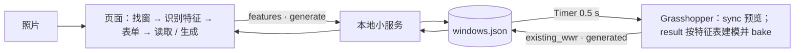

# Version_09 计划：「生成新结果」——从任意照片提取立面特征，按最终窗墙比在 Rhino 里生成立面模型（待确认，第 2 稿）

日期：2026-09-26。状态：计划，未开始修改代码。确认后：复制 V08 为 V09 → 提交 → 再修改。范围：只生成「绑定到 Rhino」的那一个立面；`calc()` / `digest()` / `uiDigest()` 不改。

第 1 稿的「Claude Code 看一次照片、写死模板」作废。第 2 稿按用户意见：**工具自己从上传的照片里提取特征**（本地识别，不联网），识别不了的项由表单选择，视觉接口等更聪明的做法只预留接口。

---

## 0. 目标与已定的决定

**用户已定（2026-09-26）**

| 事项 | 决定 |
|---|---|
| 照片特征怎么来 | 页面本地识别（颜色、檐口、材料分区、分缝），不联网、不要密钥 |
| 识别不了的项 | 表单选择（屋顶类型、出挑深度、坡度），页面先填默认值 |
| 视觉接口 | 只预留：服务留一个未启用的接口和一个隐藏按钮，以后配密钥即可接上 |
| 第一版特征 | 屋顶 / 檐口、材料分区、窗框、分缝四类（颜色随各项走）；勒脚、门、阳台预留字段不实现 |
| 生成 | 页面「生成新结果」按钮 → Grasshopper 按特征表 + 当前尺寸 + 窗墙比建模，bake 到新图层组；旧结果保留、并排 |

**原则不变**：Claude Code 只在搭 Grasshopper 定义时出现；日常上传新照片 → 识别 → 改表单 → 生成，全部在页面和 Rhino 之间完成。

**限制说清楚**：生成的是按特征表搭出来的参数化立面模型，对得上屋檐、材料分区、窗框、颜色、节奏，对不上装饰细节；识别对干净的效果图效果好，对有树影反光的实景照片会填得粗，靠表单修正。

---

## 1. 特征表（`features`）——Grasshopper 只认这一种格式

写在 `windows.json`，由页面在「读取」时写入（识别结果 + 表单当前值）；GH 只读。换照片不用改任何代码。

```json
"features": {
  "source": "page-local",
  "roof":  { "type": "flat", "eave_h": 0.35, "overhang": 0.6, "slope_deg": 0, "high_side": "right",
             "eave_color": [30,30,30], "soffit_color": [200,200,195] },
  "zones": [
    { "u0": 0.00, "u1": 1.00, "material": "siding", "color": [235,235,230], "seam": "vertical", "seam_spacing": 0.4 }
  ],
  "frame": { "width": 0.10, "depth": 0.06, "color": [25,25,25] },
  "glass_color": [60,75,90],
  "reserved": { "base": null, "door": null, "balcony": null, "corner_return": null }
}
```

| 字段 | 谁填 | 说明 |
|---|---|---|
| `roof.type` | 表单 | `flat` 平 / `shed` 单坡 / `gable` 双坡（脊线平行立面，看到的是檐口和向后的坡）；默认 flat |
| `roof.eave_h` | 识别 → 可改 | 檐口板高度 m：立面框顶部往上找连续的深色横带，按像素比例换算到 F·H；找不到 = 0 |
| `roof.overhang` | 表单 | 出挑 m，默认 0.6（找到檐口）或 0（没找到）；识别不了 |
| `roof.slope_deg / high_side` | 表单 | 只在 shed / gable 时用；默认 10°、右侧高 |
| `roof.eave_color / soffit_color` | 识别 → 可改 | 檐口带的中位颜色；檐底默认浅灰 |
| `zones[]` | 识别 → 可改 | 立面框沿宽度按颜色分段：每段起止比例、材料、颜色、分缝方向与间距 |
| `zones[].material` | 识别（按颜色归类）→ 可改 | `siding` 板墙（浅色）/ `wood` 木板（棕色，r > g > b 且饱和）/ `dark` 深色板 / `render` 抹灰 / `brick` 砖（红褐）；只影响图层名和默认分缝 |
| `zones[].seam / seam_spacing` | 识别 → 可改 | 分缝方向：该段里横向梯度 vs 纵向梯度谁强（竖向压条 → 沿 x 的变化强 → `vertical`）；间距用列均值亮度的自相关找主周期，换算成米；找不到 → `none` |
| `frame.width / depth` | 表单 | 默认 0.10 / 0.06 m；识别不可靠，不识别 |
| `frame.color / glass_color` | 识别 → 可改 | 窗框颜色 = 窗框边缘 2 px 内的中位颜色；玻璃颜色 = 窗框中心区域的中位颜色 |
| `reserved.*` | — | 勒脚、门、阳台、转角回转：字段留着，GH 忽略 |

识别全部是纯函数 `extractFeatures(imageData, fb, boxes, dims)`，自检可用合成图验证。

---

## 2. 页面

**2.1 「立面特征」表单**：放在照片面板的框列表下方，识别后自动填，随时可改。
- 屋顶：类型下拉、檐口高、出挑、坡度、高侧（后两项只在坡屋顶时显示）。
- 分区：每段一行「从 x% 到 y%｜材料下拉｜颜色块（可点开改）｜分缝下拉｜间距」，可删可加。
- 窗框：宽、深、颜色块；玻璃颜色块。
- 按钮「重新识别」（按当前立面框和窗框重跑识别，覆盖表单）；「智能解读」按钮**隐藏**，只在服务回报 `capabilities.vision === true` 时显示（预留）。
- 表单值全部存在 `S.features`，页面刷新后从文件恢复。

**2.2 「读取」**：V08 的行为不变，另把 `features` 一起写进文件。「自动找窗」之后自动跑一次识别并填表单。

**2.3 「生成新结果」**：在绑定面板里与「同步到 Rhino」并排。按下：先 `rhinoSync()`（Rhino 与页面一致），再 POST `{features, generate:{seq, at, wwr}}`，轮询 `generated.seq` 最多 8 s，提示「已生成 R03（40%，图层 Results::R03 40%）」。未连接置灰。

**2.4 自检加约 8 项**（不碰网络）：合成图识别——白底黑檐口带 → `eave_h` 与带高成比例；左白右棕两段 → 两个分区、材料 siding / wood；竖条纹 → `seam: vertical`、间距正确；`nextGenerate` 的 seq 递增；按钮只在绑定面板出现、未连接置灰；表单改值后 `S.features` 跟着变；`digest()` 不变。

---

## 3. 数据流与参数表其余新字段



- `generate`（页面写）：`{"seq": 3, "at": "…", "wwr": 0.40}`。
- `generated`（GH 写）：`{"seq": 3, "layer": "Results::R03 40%", "at": "…", "objects": 57}`。
- 服务：`POST /state` 允许字段加 `features`（按 §1 逐项检查类型与范围）和 `generate`；`generated` 只有 GH 写。预留 `POST /features/vision` → 返回 501「未配置」；`GET /state` 附带 `capabilities: {vision: false}`。

---

## 4. Grasshopper 第三脚本「WWR result」

输入：`path`，以及「WWR sync」新增的输出口 `seq`（文件里的 `generate.seq`）。`seq` 大于上次处理过的值才动作：
1. 与「WWR sync」同一段代码算 k（同一窗墙比得到同一窗宽）。
2. 按特征表建模（Brep）：
   - 每个 `zone` 一块墙板：宽 (u1 − u0)·L、高 F·H、厚 0.2 m；颜色 = `zone.color`。
   - 分缝：`vertical` → 沿 x 每 `seam_spacing` 一条 0.04 × 0.02 m 的压条，避开窗洞；`horizontal` → 每 `seam_spacing` 一条 0.01 m 深的凹槽（用薄条表示）；`none` → 不做。
   - 屋顶：`flat` → 檐口板（L + 2·overhang 长、eave_h 高、0.05 厚，贴出挑前缘）+ 檐底板；`shed` → 檐口板随坡倾斜（高侧按 `high_side`），屋面板向后延 2 m；`gable` → 檐口水平，屋面板向后上方倾斜 2 m。
   - 窗：每扇按 k 缩放后的宽度，四条框（`frame.width` 宽、`frame.depth` 深）+ 内凹 0.05 m 的玻璃面；逐层重复。
3. 整体平移到 x = seq × (L + 3)。
4. bake 到 `Results::R<seq> <wwr%>`，子图层按材料 / 构件：`Zone_1_siding`、`Zone_2_wood`、`Seams`、`Fascia`、`Soffit`、`Roof`、`Frames`、`Glass`；图层颜色 = 特征表颜色，并给每层一个同色的基础材质。
5. 写回 `generated`。不删除旧结果。

组件 6 → 7。

---

## 5. 实施顺序

| 步 | 做什么 | 完成标准 |
|---|---|---|
| 1 | 复制 V08 为 V09，提交 | — |
| 2 | 识别函数 + 表单 + 写入 `features`；自检 | 现有照片：找到檐口带、一段浅色分区、竖向分缝、黑色窗框；表单能改；合成图自检过 |
| 3 | 服务字段；GH 第三脚本按特征表建模（先手改 `generate.seq` 触发） | Rhino 出现 `Results::R01 40%`，各子图层有对象、颜色对；窗宽与预览一致 |
| 4 | 页面「生成新结果」按钮 | 按下 ≤ 8 s 出现 R02，提示正确；再按出现 R03 并排 |
| 5 | 对照照片看效果；换一张风格不同的照片（比如砖墙横窗）走一遍 | 透视截图与照片并排由你判断；第二张照片不改代码也能生成 |
| 6 | 边界（60% / 20%）、`digest()`、记录 | 全过 |

---

## 6. 验收

| 验收项 | 通过标准 |
|---|---|
| 识别 | 现有照片：`eave_h` 在 0.25–0.45 m、分区 1 段浅色、分缝 vertical、窗框色深；合成图 3 项自检过 |
| 表单 | 改屋顶类型为 shed 再生成，Rhino 结果的檐口倾斜 |
| 生成 | ≤ 8 s 出现新图层组，子图层对象数 > 0，颜色 = 特征表 |
| 一致 | 结果窗宽 = 同一窗墙比下预览窗宽（差 < 1 mm） |
| 并排 | R01–R03 沿 X 错开 L + 3 m |
| 通用 | 第二张照片（不同材料 / 屋顶）不改代码走通 |
| 工具不受影响 | `digest()` 与 V06–V08 相同；自检 120 + 约 8 项全过 |
| 未连接 | 生成按钮置灰；识别与表单照常可用 |

---

## 7. 需要你决定的问题

1. **版本**：复制 V08 为 V09（推荐）。
2. **结果摆放**：沿 X 并排错开 L + 3 m（推荐），或叠在原位靠图层开关比较。
3. **分区最少宽度**：颜色分段时窄于立面 5% 的段并入邻段（推荐），避免把阴影切成一段。
4. **窗框宽度**：表单默认 0.10 m、不识别（推荐）；或尝试识别（不可靠）。
5. **坡屋顶**：第一版做 flat / shed / gable 三种（推荐），或只做 flat。
6. **第二张测试照片**：由你提供一张风格不同的（推荐），或我用合成图代替。
7. **预留项**：勒脚、门、阳台、转角回转只留字段（按你的决定）。
