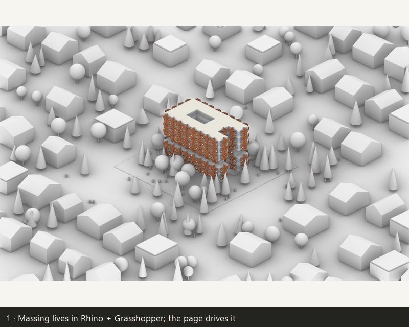

# MassShadeLight

**Demo (GitHub Pages, read-only snapshot):** https://ay-xa.github.io/ARCH-540/Openning_Shade_Relation_Tool/01_Prototype/Strip_Window/Massing_v01/massing-tool-en.html
(中文版 / Chinese interface: https://ay-xa.github.io/ARCH-540/Openning_Shade_Relation_Tool/01_Prototype/Strip_Window/Massing_v01/massing-tool.html)

The demo shows a saved design state with every panel of the tool. The live loop — move a slider, Rhino rebuilds the massing, Ladybug recounts sun hours — needs Rhino 8 on your own computer; see **How to use it**.

ARCH 540 (UBC SALA) design-tool project. The tool lives in `Openning_Shade_Relation_Tool/01_Prototype/Strip_Window/Massing_v01/`. Earlier prototypes that fed into it (window-wall-ratio tools, zoning, strip-window facade study) are kept in `Passivehouse_Tool/` and `Openning_Shade_Relation_Tool/` for reference.

---

## 1. Purpose

The tool connects the architect’s visual design process with real-time building performance feedback. By interactively adjusting building massing, window-to-wall ratio (WWR), and external shading devices, designers can directly observe how façade and form changes affect daylight availability and overheating risk within the building.

Using daylight and overheating as key design constraints, the tool provides simplified performance estimates informed by Passive House thermal comfort principles, including the guideline that indoor temperatures should not exceed 25°C for more than 10% of annual hours. Rather than replacing detailed energy simulation, the tool enables designers to understand the dynamic relationship between façade design, building massing, daylight, and thermal performance throughout the design process, supporting continuous design iteration.

---

## 2. How to use it

### What it is

Three parts that talk through one file, `rhino/state.json`:

| Part | File | Role |
|---|---|---|
| Web page | `massing-tool-en.html` (English) / `massing-tool.html` (中文) | sliders, plan heatmap, facade-segment table, window section, scheme comparison, image inbox |
| Local bridge | `rhino/server.py` (Python 3, standard library only) | serves the page on `http://localhost:8768`, validates every change, writes `state.json` |
| Rhino + Grasshopper | `rhino/massing.3dm`, `rhino/massing.gh` | rebuilds floors, windows and shading devices from `state.json`; Ladybug counts direct sun hours and writes them back |

Overheating and daylight are estimated on the page by a shared engine (`Passivehouse_Tool/01_Prototypes/_shared/wwr-engine.js`) from the wall segments Rhino writes back. Self-shading by the building’s own massing comes from Ladybug.

### Requirements

- Windows 10/11 (the launcher is a `.bat`; only Windows was tested).
- **Rhino 8** with Grasshopper (tested with Rhino 8.27).
- **Ladybug Tools** for Grasshopper (the `.gh` uses *LB Import EPW*, *LB Analysis Period*, *LB SunPath* and two *LB Direct Sun Hours*). Tested with the version installed on the author’s machine in 2026; if a Ladybug component appears as missing in your version, re-place it from your Ladybug tab and reconnect the same wires.
- **Python 3.10 or newer** on the PATH (tested with 3.13). No packages to install for the server.
- A browser (Chrome or Edge). The scheme list is stored in the browser.

### Run it

1. **Download the whole repository** (Code → Download ZIP, or `git clone`). Keep the folder structure: the page, the climate files and the shared engine find each other by relative paths.
2. Open `Openning_Shade_Relation_Tool/01_Prototype/Strip_Window/Massing_v01/rhino/` and **double-click `start_server.bat`**. A console window stays open and the browser opens `http://localhost:8768`. The status line should read *connected to local service*.
   If the page opens in Chinese, click **EN** at the top of the sidebar (and **中文** to switch back).
3. In Rhino 8, **open `rhino/massing.3dm`**, then open Grasshopper and **open `rhino/massing.gh`** from the same folder. The panel named `state.json` in the definition holds a relative name, so it works wherever the folder lives. Within a second the status line changes to *Rhino wrote back hh:mm:ss* and the plan, table and section fill in.

### Designing with it

The tool is meant to be used as a loop, in roughly this order:

1. **Choose or describe a shading device.** The library has four adjustable devices (pivot panels, vertical and horizontal knee folds, hexagonal umbrella). To bring in your own, open **Read image**, upload a sketch, photo or motion diagram of the device, add one line of description and send it. A language model fills in a parameter card — which sun it blocks, how it moves, unit size, what part of the window it covers, which library entry it is closest to. Every field can be edited, and *Apply to design* turns the card into an adjustable device on the facades. (The card is written by Claude: either through your own Anthropic API key file next to `server.py`, or by asking Claude in a chat session to read the inbox.)
2. **Set the overall massing first.** Footprint, number of floors, floor groups with setbacks or shifts, window-wall ratio, climate station and room depth. Rhino rebuilds within a second; the plan heatmap, the facade-segment table and the window section follow, and Ladybug sun hours arrive 10–60 s later.
3. **See what the device does to daylight and overheating.** Open the device per facade, change its angle, choose from which floor it starts. The table lists every facade segment *bare* and *with device*; the section shows which sun angles the device actually blocks; the *Reading* panel says in sentences where the hot spots and the best-lit segments are.
4. **Reshape the massing with topology operations.** Add notches, courtyards and splits — any number, on all floors or one floor group — and move them with the sliders or by dragging the red / blue / green handles in Rhino. Watch the plan heatmap: grey cells are too deep for any facade to help; the aim is a plan where every room band gets daylight without the overheating hot spots. When a cut is ignored (too close to another, or it would leave a thin wall), the page marks it with ⚠ and says why.
5. **Keep what works.** *Save scheme* stores the current state in the browser; **Compare** puts 2–4 schemes side by side with the differences, so a device change and a massing change can be weighed against each other.
6. Optional: `rhino/context_gen.py`, run in Rhino’s script editor, generates a 50 × 50 m lot with neighbouring houses, trees and people around the building for presentation renders (Arctic display mode). It is visual only and does not enter any calculation.

### Reading a picture of a device (the *Read image* tab)

The page itself cannot look at a picture; a model has to. Three ways, from least to most effort:

1. **Your own Anthropic API key — automatic.** Save the key as one line in `rhino/api_key.txt` (the file is git-ignored) and restart `start_server.bat`. The sidebar of *Read image* then shows *mode: call the model directly*. Upload a sketch, photo or motion diagram, add one line of description, send. The server passes the picture and the eight-question card template to Claude and the parameter card appears on the page in a few seconds, ready to edit and *Apply to design*.
2. **No key, but Claude Code with this repository open — one sentence in the chat.** The sidebar shows *mode: hand to Claude*. After you send the picture, it is stored in `Openning_Shade_Relation_Tool/02_Rules/inbox/<timestamp>/` together with your description. In Claude Code type:

   ```
   Read image: follow Openning_Shade_Relation_Tool/02_Rules/inbox/README.md, process the newest picture in the inbox and write its card.json
   ```

   Claude writes the card; the page checks the inbox every few seconds and shows it.
   To get there: install Claude Code (desktop app from claude.ai/code, or `npm install -g @anthropic-ai/claude-code`), sign in with your own Claude account, open this repository folder as the project (it reads `CLAUDE.md` automatically). Rhino and the local server are still started by hand as in *Run it*. Claude Code can edit files in the repository: reading a picture only writes `card.json`, but asking it to “add a new device to the library” changes code that you should verify.
3. **No model at all — by hand.** `inbox/README.md` defines the card: which sun it blocks, element direction, unit size, density and layout, transparency, how it moves, which side of the glass, which part of the window it covers, plus the closest library entry. A person can write that `card.json` into the inbox folder and the page shows it the same way.

In every case the card maps onto one of the four library devices. For a motion the library does not have, the card names the closest entry and the differences; building it in 3D means adding a new entry in `rhino/massing_sync.py`. The GitHub Pages demo has no server, so its upload button does nothing.

### If something does not move

- Status line says *Rhino 15 s without a write-back*: Grasshopper’s timer stopped. The watcher restarts itself; if it still sits, click the *Trigger* component once (pause) and again (play), or reopen `massing.gh`.
- *no local service*: the server console is closed, or port 8768 is taken by an earlier instance. Close the old console and run `start_server.bat` again.
- Rhino shows nothing after a parameter change: look at the `status` panel next to the *massing sync* component; it prints the reason (for example a notch that was ignored because it overlaps another one — the page marks those with ⚠ too).

---

## 3. Source

- **Passive House Institute China — “Passive House Requirements”**, https://phichina.com/passive-house-requirements.html (accessed 2026-10-02; the page carries no version number or date).
  Clause used: item **4, Thermal comfort** — *“not more than 10 % of the hours in a given year over 25 °C.”*
  The tool reports the share of hours above 25 °C as *overheating*; 10 % is drawn as the limit. The 5 % *recommended* target shown next to it is the tool’s own working value, not part of the cited page.
- Everything else is an assumption of the tool, not a regulation: the daylight-factor threshold (3 % shown as *sufficient*), the simplified hourly thermal model and its coefficients in `wwr-engine.js` (documented in `Passivehouse_Tool/01_Prototypes/_shared/ENGINE.md`), and the climate data from three Vancouver EPW files in `Passivehouse_Tool/02_Data/EPW/` (CWEC2020 airport, TMYx harbour, and a 2080s SSP5-8.5 morphed file; see the README in that folder).

---

## 4. One example



Input (the state saved in `rhino/state.json`): 26 × 16 m footprint, 16 floors in 4 groups (ground floor and floor 4 set back), WWR 66 %, one notch on the east edge (5.5 m deep), one notch on the south edge (6.5 m deep, upper group only), one 5.5 × 5.0 m courtyard in the upper group, Vancouver airport climate.

Result for two shading devices on the same massing (from the *Compare* tab):

| | Hexagonal umbrella, 31° | Pivot panels, 31° |
|---|---|---|
| Overheating, no device | 10.2 % | 10.2 % |
| Overheating, with device | 4.2 % | 3.4 % |
| Daylight factor, with device | 3.48 % | 3.26 % |
| Summer direct sun on windows (Ladybug) | 254 h | 309 h |
| Device units | 204 | 237 |

Frames in the GIF: Rhino model with its context → sliders and plan heatmap → facade-segment table → section through the device with sun angles → topology operations in Rhino → scheme comparison. Still images are in `screenshots/`.

---

## 5. Skill and limits

**Reusable files**

- `Openning_Shade_Relation_Tool/02_Rules/SHADING_RULES.md` — how a shading device is described and turned into tool parameters.
- `Openning_Shade_Relation_Tool/02_Rules/MECHANISMS.md` — the device library (pivot, vertical knee fold, horizontal knee fold, hexagonal umbrella) and which parameters each one really uses.
- `Openning_Shade_Relation_Tool/02_Rules/inbox/README.md` — the eight-question parameter card a model fills in when reading a picture of a device.
- `Openning_Shade_Relation_Tool/01_Prototype/Strip_Window/PLAN_massing_v0*.md` and `WORK_LOG.md` — design decisions and the session-by-session record.

**What the tool does not do / where a person must check**

- Overheating and daylight are **estimates for comparing options**, not a simulation result. They use one room band along each facade, fixed internal gains and ventilation assumptions, and a simplified hourly model. Do not quote the numbers as absolute performance.
- Sun hours are **direct sun on the window band** (Ladybug Direct Sun Hours, no radiation, no sky model). Self-shading counts the building’s own floors and devices only; neighbouring buildings and the generated context are not in the calculation.
- Shading devices are geometric idealisations (opaque panels, one tilt per facade); perforation, materials and glare are not modelled.
- Only three Vancouver climate files are included. Other locations need their own EPW and a new climate entry in the engine.
- The thin-wall and overlap rules (1 m) for notches, courtyards and splits are drawing conveniences, not code requirements.
- The Pages demo is a saved snapshot: sliders there do not recompute. The live loop was tested on one Windows machine with Rhino 8.27.
